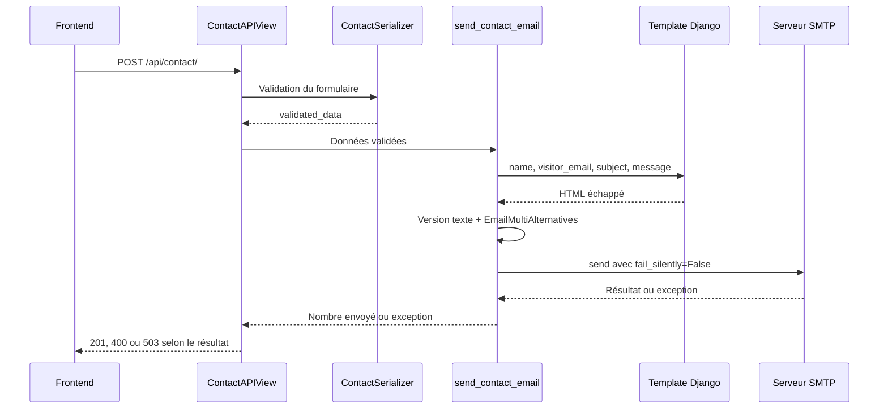

# Construction et envoi de l'email

Sources : `contact/services.py`, `contact/templates/contact/contact_email.html`
et `config/settings.py`.

## Contenu et adresses

Le sujet est préfixé par `[alblanchard.fr] Nouveau message — `.
`render_to_string("contact/contact_email.html", context)` génère le HTML ;
`APP_DIRS=True` permet de trouver ce template dans l'application.
Le contexte contient `name`, `visitor_email`, `subject` et `message`.
Le template échappe les variables et applique `linebreaksbr` au message pour
préserver ses retours à la ligne. Il ne traite pas le message comme du HTML libre.

Le service construit séparément la version texte, puis attache le HTML avec
`EmailMultiAlternatives.attach_alternative(..., "text/html")`.
Le nom du site reste inscrit dans les deux versions.

| En-tête | Valeur |
| --- | --- |
| From | `DEFAULT_FROM_EMAIL` |
| To | Liste contenant uniquement `CONTACT_EMAIL` |
| Reply-To | Adresse email validée du visiteur |

La réponse du destinataire peut ainsi partir vers le visiteur sans usurper son
adresse comme expéditeur SMTP. Django peut lever `BadHeaderError` pour un
en-tête invalide ; le contrôleur le transforme en 400. L'échappement HTML et
ce contrôle d'en-tête ne remplacent pas une protection anti-spam.

## Exploiter et diagnostiquer

Configurer le serveur, l'identifiant et le secret SMTP, l'expéditeur et la
destination dans les [variables Contact](../../getting-started/configuration.md).
Le backend SMTP utilise STARTTLS par défaut, le port 587 et un timeout de
10 secondes ; SSL direct est désactivé dans le code.

En cas de 400, distinguer les erreurs par champ des erreurs d'en-tête. En cas
de 503, consulter les logs du conteneur API et vérifier les paramètres,
l'authentification et l'accès réseau SMTP. Ne pas exposer les secrets dans
les captures de logs. Un contrôle de disponibilité HTTP de l'API ne teste pas
l'envoi SMTP ; une validation de bout en bout demande un message de test vers
une destination maîtrisée.
