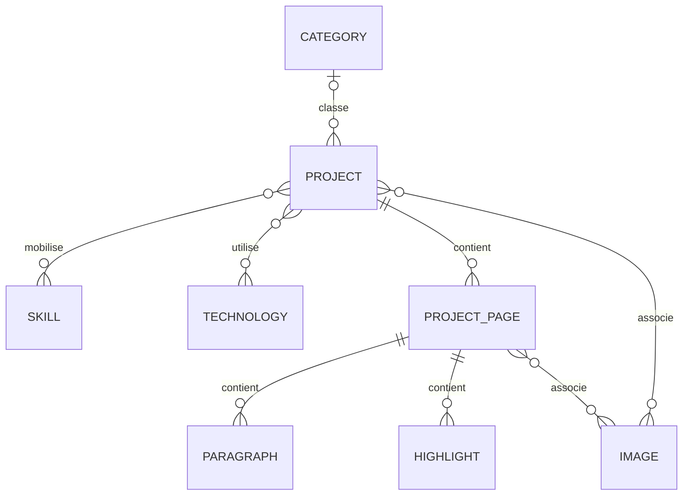

# Modèle conceptuel Projects

Source : `projects/models.py`. Chaque entité ci-dessous porte une clé primaire
UUID ; les projets et pages utilisent des slugs dans leurs routes.

## Projet et classification

Project contient un titre et slug de 200 caractères maximum, `project_type`
(100 caractères), une description texte, les URLs facultatives `github_url`,
`website_url`, `client_url`, `started_at` requis et `ended_at` facultatif/nullable.
`published` vaut False par défaut. `created_at` et `updated_at` suivent le cycle
de l'enregistrement ; ce ne sont pas les dates métier du projet.

Un projet a zéro ou une Category, plusieurs Skill et plusieurs Technology.
Category est la classification principale ; Skill désigne une compétence
(par exemple Backend), Technology un outil concret (par exemple Django).
Il n'existe pas de relation directe Skill–Technology. Chaque référence a un
`name` et un `slug`, chacun unique et limité à 100 caractères.

Les écritures Project acceptent la catégorie comme chaîne et les compétences
et technologies comme listes de noms. Les UUID restent exposés sur les objets
qui comportent un champ `id`, mais ne sont pas requis pour ces relations nommées.

## Pages et blocs

Une ProjectPage appartient exactement à un Project. Son slug (200 caractères)
est unique dans ce projet. Elle comporte `title` (200), `subtitle` facultatif
(255), `mermaid` texte facultatif, `position` et `published` (False par défaut).
`layout` accepte `default`, `image-top` et `image-bottom`, avec `default` par défaut.

Paragraph porte un texte `content` ; Highlight un `content` de 255 caractères
maximum. Chacun appartient à une page et porte `position`.
Pages, paragraphes et highlights sont triés par `position`, entier positif ou
nul, par défaut 0. Cette position n'est pas unique : l'ordre entre ex æquo
n'est pas spécifié et aucune renumérotation automatique n'est implémentée.
Les projets, images et références n'ont pas d'ordre métier déclaré au modèle.

## Images et suppression

Image porte `file`, `alt` (255 caractères), `theme` (50 caractères, vide par
défaut) et `created_at`. Un même objet Image peut être lié à plusieurs projets
et pages. Le thème appartient à l'image, pas au lien ManyToMany.

La suppression d'un Project cascade vers ses pages et leurs contenus.
La suppression d'une Category conserve les projets avec `category=NULL`.
Supprimer une Skill ou Technology retire ses associations sans supprimer
les projets. Les liens images suivent les propriétaires supprimés, mais les
images et fichiers ne sont pas automatiquement collectés dans ce parcours.

Voir [images](images.md) pour distinguer suppression d'association et suppression
globale, et [persistance](../../architecture/database.md) pour les contraintes SQL.
