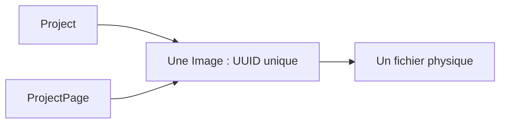

# Images : téléversement, partage et cycle de vie

Sources : `ImageSerializer`, `ImageViewSet`, `ProjectImageViewSet`,
`ProjectPageImageViewSet` et `remove_image_from_owner` dans `projects/views.py`.

## Créer une image

Avec un JWT staff, envoyer un POST `multipart/form-data` comportant `file` et
`alt`, avec `theme` facultatif. Les routes sont :

- `/api/images/` : crée une Image sans propriétaire ;
- `/api/projects/<project_slug>/images/` : crée et associe au projet ;
- `/api/projects/<project_slug>/pages/<page_slug>/images/` : crée et associe à la page.

Le serializer valide le fichier comme image et limite sa taille à **10 Mio**
(10 × 1024 × 1024 octets, limite incluse). Aucune règle métier supplémentaire
de dimensions n'est déclarée. `alt` est limité à 255 caractères et `theme` à 50.
Un thème vide désigne l'image générique ; les autres thèmes sont des chaînes
libres dont la signification appartient au frontend.

Les créations contextuelles refusent une deuxième image du même thème pour
le même propriétaire. Cette vérification n'est pas une contrainte SQL :
l'édition globale de `theme` et les écritures concurrentes ne sont pas couvertes
par une garantie universelle d'unicité par propriétaire.

## Associer une Image existante à une page

L'endpoint exact est :

```text
POST /api/projects/<project_slug>/pages/<page_slug>/images/attach/
Authorization: Bearer <access>
Content-Type: application/json
```

```json
{"image_id": "91bd7a92-9fab-4e27-8311-a6a89793d8ce"}
```

Remplacer cet UUID d'exemple par le `id` d'une Image existante. La réponse
**200** est sa représentation (`id`, `file`, `alt`, `theme`, `created_at`).
L'opération ajoute seulement une association ManyToMany : même UUID, même
référence et même fichier physique, sans copie ni nouvel upload.



Le contrôleur recherche la page dans le projet de l'URL, puis l'image globale :
elle n'a pas besoin d'être déjà liée au projet parent. Un `image_id` absent ou
vide donne **400** ; un UUID valide inexistant, un projet ou une page inexistante
donnent **404**. Un autre objet Image du même thème sur la page donne **400**.
Réassocier la même image est idempotent et renvoie 200.

L'action lit directement `request.data` sans serializer UUID dédié : ne pas
supposer un contrat de validation 400 stabilisé pour les identifiants mal formés.
Il n'existe pas d'action `attach` équivalente pour Project dans les URLs actuelles.

## Modifier et retirer

Les détails des images contextuelles n'exposent que **DELETE**. Pour modifier
les métadonnées ou remplacer le fichier, utiliser le détail global staff
`/api/images/<uuid>/`. Une modification globale affecte tous les propriétaires
du même objet Image, notamment son thème et son URL de fichier contrôlée.

| Opération | Effet réel |
| --- | --- |
| DELETE image contextuelle | Retire le lien au propriétaire de l'URL |
| Dernier lien retiré par ce DELETE | Supprime Image, puis son fichier via le storage |
| D'autres propriétaires restent | Conserve Image et fichier |
| DELETE global `/api/images/<uuid>/` | Supprime l'objet et ses liens ; pas de nettoyage physique personnalisé |
| DELETE Project ou ProjectPage | Supprime le propriétaire et ses liens ; ne collecte pas ses images orphelines |
| Remplacement global du fichier | Pas de nettoyage explicite de l'ancien fichier |

La suppression contextuelle vérifie que l'image appartient bien au propriétaire
demandé, sinon 404. Le nettoyage de la dernière association n'est pas une
transaction atomique entre base et disque, et il n'existe pas de nettoyage
général par signal ou tâche de fond.

Pour la lecture publique/staff, le cache, HEAD, les fichiers absents et les
prévisualisations JWT, voir l'[architecture média](../../architecture/media.md).
