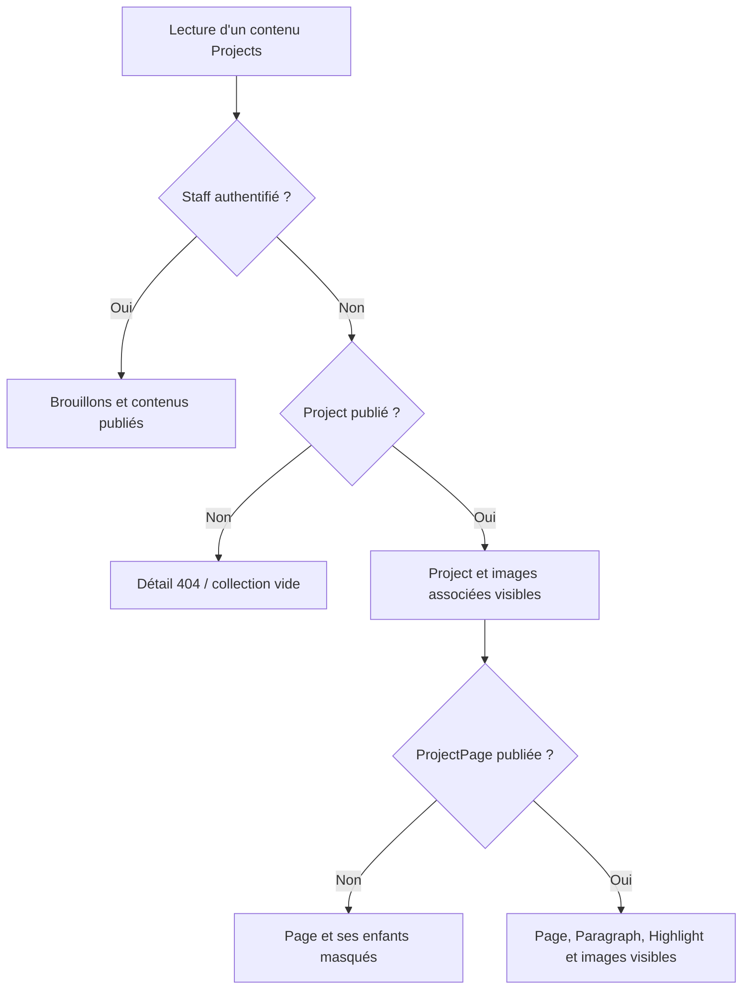

# Publication et visibilité

Sources : `StaffPublicationMixin`, `ProjectPageChildMixin`,
`ProjectViewSet.get_queryset()` et `ImageFileView.get()`.

La publication est un filtre de lecture. Un compte authentifié avec
`is_staff=True` voit aussi les brouillons ; un compte non-staff a la même
visibilité métier qu'un visiteur anonyme.

## Règles par ressource

| Ressource | Condition de lecture publique |
| --- | --- |
| Project | `published=True` |
| ProjectPage | Page publiée **et** projet parent publié |
| Paragraph / Highlight | Page parente publiée **et** son projet publié |
| Collection d'images de projet | Projet demandé publié |
| Collection d'images de page | Page demandée publiée **et** son projet publié |
| Fichier Image | Au moins une association publique valide, voir ci-dessous |

Une page publiée sous un projet brouillon reste privée. Publier un projet ne
change pas automatiquement les flags de ses pages. Dépublier le projet masque
ses pages sans modifier leurs flags : une republication les rend à nouveau
visibles si elles ont conservé `published=True`.

Les pages imbriquées dans le JSON Project sont filtrées elles aussi. Les
collections contextuelles d'un parent invisible ou inexistant renvoient une
liste vide ; un détail masqué renvoie 404. Le filtrage de lecture ne donne
aucun droit d'écriture : les mutations restent réservées au staff.

## Cas particulier des images partagées

Un fichier est public s'il est lié à un Project publié **ou** à une ProjectPage
publiée dont le Project est publié. Une image partagée par un projet privé
et un projet public reste donc publiquement lisible. À l'inverse, une page
brouillon d'un projet publié et une page publiée d'un projet brouillon ne
forment pas ensemble une association valide.

La collection contextuelle suit toujours le propriétaire de l'URL : partager
son image ailleurs ne rend pas la collection d'un propriétaire privé visible.
Une image sans association est réservée au staff sur la route fichier.
La collection globale `/api/images/` et son détail sont toujours staff-only,
même quand le fichier est public.

Voir [permissions](../../api/permissions.md) et [accès média](../../architecture/media.md).
