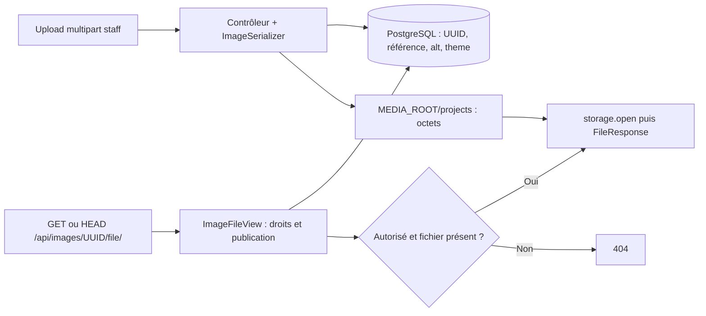

# Stockage et accès aux médias

Sources : `Image` dans `projects/models.py`, `ImageSerializer` et `ImageFileView`,
`config/settings.py`, `config/urls.py`, `compose.yaml`.

## Séparer la référence et les octets

`Image.file` est un `ImageField(upload_to="projects/")`. PostgreSQL enregistre
une référence relative ; le storage Django écrit le fichier sous `MEDIA_ROOT`.
Le backend actuel utilise le stockage local, sans configuration de stockage
objet distant. Le conteneur monte `/srv/media/chinchillapi` sur `/app/media`.



## Route contrôlée

`GET /api/images/<uuid>/file/` renvoie un `FileResponse`, permettant la lecture
par blocs. `HEAD` applique les mêmes contrôles, sans corps dans la réponse HTTP.
Le serializer expose cette route dans `file` : URL absolue s'il dispose d'une
requête, relative sinon. Une référence vide est représentée par `null`.

Le staff authentifié peut lire une image privée ou sans propriétaire. Pour les
autres utilisateurs, au moins un projet publié associé **ou** une page publiée
d'un projet publié associé est nécessaire. Les deux conditions de page doivent
être vraies sur la même association. Le partage avec un propriétaire privé
n'annule pas une association publique valide.

UUID inconnu, accès privé, référence vide ou fichier absent renvoient **404**.
Le fichier privé n'est pas ouvert avant le contrôle des droits.
Un JWT invalide peut être rejeté en **401** par l'authentification avant ces
contrôles. La négociation de contenu forcée accepte notamment un en-tête
`Accept: image/*` ; les erreurs restent des réponses DRF.

`never_cache` désactive le cache HTTP des réponses afin de revérifier la
publication à chaque requête. Cela ne révoque pas un fichier déjà téléchargé.

## Pas de route publique du storage

`MEDIA_URL=/media/` est défini, mais aucune route `static(MEDIA_URL, ...)`
n'est ajoutée, même avec `DEBUG=True`. Le reverse proxy ne doit pas exposer
`MEDIA_ROOT` : une telle route contournerait le filtrage de publication.
Les statiques Django sont un sujet distinct, traité dans le
[déploiement](../deployment/storage.md).

## Prévisualisation privée dans un frontend

Une balise `` seule n'ajoute pas de Bearer token. Le client staff
peut télécharger le fichier avec son JWT puis créer une URL de blob :

```javascript
const response = await fetch(fileUrl, {
  headers: { Authorization: `Bearer ${accessToken}` },
});
if (!response.ok) throw new Error(`Image inaccessible (${response.status})`);
const previewUrl = URL.createObjectURL(await response.blob());
// Utiliser previewUrl comme src de l'image.
// Appeler URL.revokeObjectURL(previewUrl) au remplacement ou démontage.
```

C'est un exemple d'intégration, pas un frontend fourni par le dépôt. Pour une
image publique, `file` peut être utilisé directement comme `src`.
Voir les [uploads, associations et suppressions](../apps/projects/images.md).
