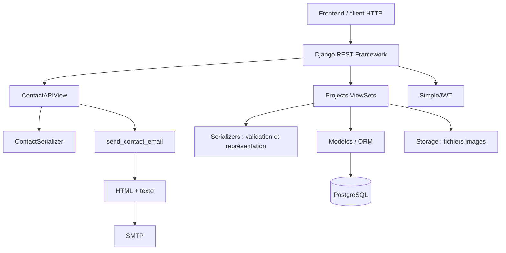

# Architecture générale

ChinchillAPI expose deux domaines indépendants sous `/api/` : le traitement
des messages Contact et la gestion éditoriale Projects. `config/` rassemble
les settings et le routage global, avec les routes JWT, OpenAPI et admin Django.

## Responsabilités

| Couche | Rôle et fichiers |
| --- | --- |
| Routage | `config/urls.py`, `contact/urls.py`, `projects/urls.py` sélectionnent le contrôleur |
| Contrôleurs HTTP | APIView / ViewSets dans `views.py` : permissions, sélection des ressources, orchestration, réponses |
| Serializers | Validation et représentation ; certaines validations consultent l'ORM |
| Service Contact | `contact/services.py` construit et envoie l'email |
| Modèles | `projects/models.py` : persistance, relations, contraintes et ordre |
| Comportements partagés | `projects/mixins.py` : filtrage staff/public et contexte des enfants de page |
| Permissions | `projects/permissions.py` : lecture sûre publique, écriture staff |

Projects n'a pas de couche `services.py` : son orchestration des relations se
trouve actuellement dans les contrôleurs. Contact ne persiste pas les messages
en base. Les tables Django d'authentification et de sessions complètent les
tables métier Projects.

`ProjectViewSet.get_queryset()` utilise `select_related` pour la catégorie et
`prefetch_related` pour les collections, dont les pages filtrées selon le rôle.
Le filtrage imbriqué empêche de révéler une page brouillon par la représentation
JSON d'un projet publié ; les tests vérifient aussi la stabilité du nombre de
requêtes sur ce parcours.

En production, Gunicorn sert Django dans le conteneur API. PostgreSQL et les
médias ont des stockages persistants distincts. Le dépôt fournit le Compose et
le workflow de déploiement, mais pas la configuration du reverse proxy HTTPS.
