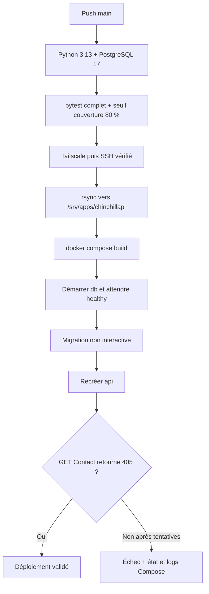

# Pipeline CI/CD

Source : `.github/workflows/deploy.yml`. Le workflow **Deploy API** est déclenché
par un push sur `main`. Le groupe de concurrence `chinchillapi-production`,
avec `cancel-in-progress: false`, évite de lancer plusieurs déploiements actifs
simultanément sans interrompre celui en cours.



## Tests avant déploiement

Le job `test`, limité à 15 minutes, s'exécute sous `ubuntu-latest`. Il utilise
Python 3.13 et un service PostgreSQL 17 exposé sur le runner en 5432, avec
des credentials CI dédiés et un healthcheck. Il installe `requirements.txt`,
les versions explicites de pytest et de ses plugins, puis lance
`python -m pytest`. Les chemins média et statiques sont sous `/tmp`.

Le job `deploy` déclare `needs: test` : l'échec des tests empêche le déploiement.
Le workflow de déploiement ne s'exécute pas sur les pull requests. Un workflow
distinct `docs.yml` construit la documentation sur les PR et sur `main`, sans
secrets applicatifs ni base de données ; il ne déploie pas l'API.

## Réseau et transfert

Le runner rejoint Tailscale via OAuth avec `tag:ci`, puis vérifie la connexion
avec `tailscale status` et `tailscale ping`. La clé privée SSH est écrite avec
des droits 600. La clé d'hôte attendue est placée dans `known_hosts` et SSH
utilise `StrictHostKeyChecking=yes`, `BatchMode=yes` et un timeout de 15 secondes.

Secrets GitHub requis : `TS_OAUTH_CLIENT_ID`, `TS_OAUTH_SECRET`, `SSH_HOST`,
`SSH_USER`, `SSH_PRIVATE_KEY`, `SSH_HOST_KEY`.

`rsync -rz --delete` synchronise le dépôt dans `/srv/apps/chinchillapi/`.
Il exclut `.env`, `.git`, `.venv`, `media/`, `staticfiles/`, `__pycache__/`,
`.pytest_cache/`, `.coverage` et `htmlcov/`. Le `.env` du serveur est conservé ;
les fichiers non exclus absents du dépôt peuvent être supprimés par `--delete`.
Les médias de production sont de plus stockés hors de ce répertoire applicatif.

## Séquence distante

SSH lance `bash -se`. Le script active `set -Eeuo pipefail` et appelle Compose
via `sudo -n /usr/bin/docker compose -f /srv/apps/chinchillapi/compose.yaml`.
Le compte SSH doit donc disposer de l'autorisation sudo non interactive nécessaire.

Après reconstruction de l'image et démarrage de `db`, le script attend jusqu'à
30 contrôles de santé espacés de 5 secondes. Il exécute ensuite :

```sh
docker compose run --rm --no-deps -T api python manage.py migrate --noinput </dev/null
docker compose up -d --force-recreate api
```

La migration est non interactive, sans TTY et avec stdin fermé.
`collectstatic` est explicitement omis : `/app/staticfiles` n'est pas partagé
et sa desserte n'est pas configurée.

Le script teste ensuite `http://127.0.0.1:8001/api/contact/` avec GET jusqu'à
30 fois, espacées de 2 secondes, et attend **405**. C'est une vérification de
réponse HTTP, pas un envoi de mail ni un contrôle fonctionnel complet de
PostgreSQL. Sur erreur, le trap affiche l'état des conteneurs et les 100 dernières
lignes des logs `db` et `api`. Aucun rollback automatique n'est implémenté.
