# Projects --- ChinchillAPI

L'application `projects` constitue le module portfolio de ChinchillAPI.
Elle expose une API REST permettant de gérer des projets, leurs pages de
contenu, leurs compétences et technologies, ainsi que les images
associées.

L'objectif n'est pas seulement de stocker les données du portfolio :
l'application sépare clairement la **validation**, l'**orchestration
métier**, la **persistance**, les **permissions** et le **stockage des
fichiers**.

> **État actuel :** API Django REST Framework avec PostgreSQL,
> authentification JWT pour l'administration, publication différenciée
> public/staff, création imbriquée contrôlée et médias protégés.

------------------------------------------------------------------------

## 1. Vue d'ensemble

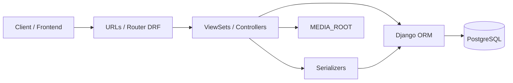

Dans cette architecture :

-   les **URLs** dirigent les requêtes ;
-   les **ViewSets sont les contrôleurs** : ils orchestrent les
    opérations ;
-   les **serializers** définissent le contrat JSON et valident les
    données ;
-   les **models** décrivent les données et leurs contraintes ;
-   Django ORM dialogue avec PostgreSQL ;
-   les fichiers sont stockés séparément dans `MEDIA_ROOT`.

Le serializer ne devient donc pas un second contrôleur. Il valide et
transforme les données ; l'orchestration des relations et des créations
complexes reste dans le ViewSet.

------------------------------------------------------------------------

## 2. Structure de l'application

``` text
projects/
├── migrations/
├── tests/
│   ├── ...
│   └── test_media.py
├── __init__.py
├── admin.py
├── apps.py
├── mixins.py
├── models.py
├── permissions.py
├── serializers.py
├── urls.py
├── views.py
└── README.md
```

### `models.py`

Définit la structure persistée :

-   `Project`
-   `ProjectPage`
-   `Paragraph`
-   `Highlight`
-   `Category`
-   `Skill`
-   `Technology`
-   `Image`

### `serializers.py`

Définit le contrat de l'API :

-   représentation JSON ;
-   validation des entrées ;
-   validation des relations nommées ;
-   validation des dates ;
-   validation des slugs ;
-   validation des uploads ;
-   sérialisation imbriquée des pages et de leur contenu.

### `views.py`

Contient les contrôleurs DRF :

-   sélection des objets visibles ;
-   orchestration des créations ;
-   résolution des relations ;
-   gestion des associations d'images ;
-   contrôle de publication ;
-   accès aux fichiers physiques.

### `mixins.py`

Centralise les comportements partagés entre plusieurs contrôleurs,
notamment :

-   filtrage public/staff ;
-   logique commune des enfants de `ProjectPage`.

### `permissions.py`

Centralise les permissions DRF, notamment la règle :

-   lecture publique ;
-   écriture réservée au staff.

### `urls.py`

Déclare les routes DRF et les routes imbriquées qui ne sont pas
naturellement représentées par le router principal.

------------------------------------------------------------------------

## 3. Modèle de données

Toutes les entités principales utilisent des **UUID** comme clés
primaires.

Les slugs restent utilisés pour les URLs humaines lorsqu'ils ont un sens
fonctionnel.

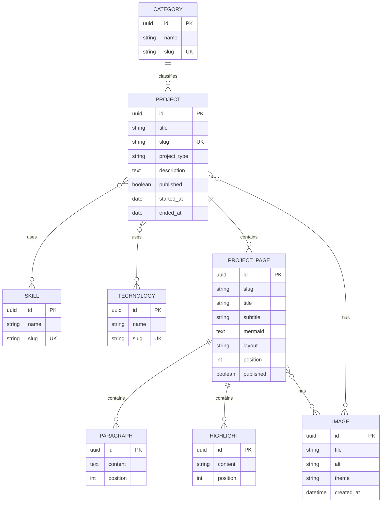

### Relations principales

Un `Project` possède :

-   zéro ou une `Category` ;
-   plusieurs `Skill` ;
-   plusieurs `Technology` ;
-   plusieurs `ProjectPage` ;
-   éventuellement plusieurs `Image`.

Une `ProjectPage` appartient à un seul projet et peut posséder :

-   plusieurs `Paragraph` ;
-   plusieurs `Highlight` ;
-   plusieurs `Image`.

### Suppression

La relation entre `Project` et `ProjectPage` utilise une suppression en
cascade : supprimer un projet supprime ses pages.

Les contenus d'une page (`Paragraph`, `Highlight`) suivent également
leur page.

La catégorie utilise une relation nullable : la suppression d'une
catégorie ne doit pas entraîner la suppression du projet.

### Unicité des pages

Un slug de page doit être unique **à l'intérieur d'un projet**, et non
dans toute la base.

Cela autorise par exemple :

``` text
/project-a/architecture
/project-b/architecture
```

mais interdit deux pages `architecture` dans le même projet.

------------------------------------------------------------------------

## 4. Skill, Technology et Category

Ces trois concepts sont volontairement séparés.

### Skill

Une compétence relativement générale :

``` text
Backend
Frontend
DevOps
Testing
```

### Technology

Une technologie concrète :

``` text
Python
Django
PostgreSQL
React
TypeScript
Docker
```

### Category

Une classification principale du projet.

Contrairement aux compétences et technologies, un projet ne possède
qu'une seule catégorie.

------------------------------------------------------------------------

## 5. Contrat JSON humain

L'API évite d'obliger le frontend à connaître les UUID des catégories,
compétences et technologies.

Un projet peut être envoyé sous une forme lisible :

``` json
{
  "title": "Lagash",
  "slug": "lagash",
  "project_type": "Projet professionnel",
  "description": "Application métier.",
  "category": "Projet pro",
  "skills": ["Backend", "Frontend"],
  "technologies": ["Python", "Django", "React", "TypeScript", "SCSS"],
  "started_at": "2026-09-01",
  "published": true
}
```

Le contrôleur résout ensuite les objets correspondants.

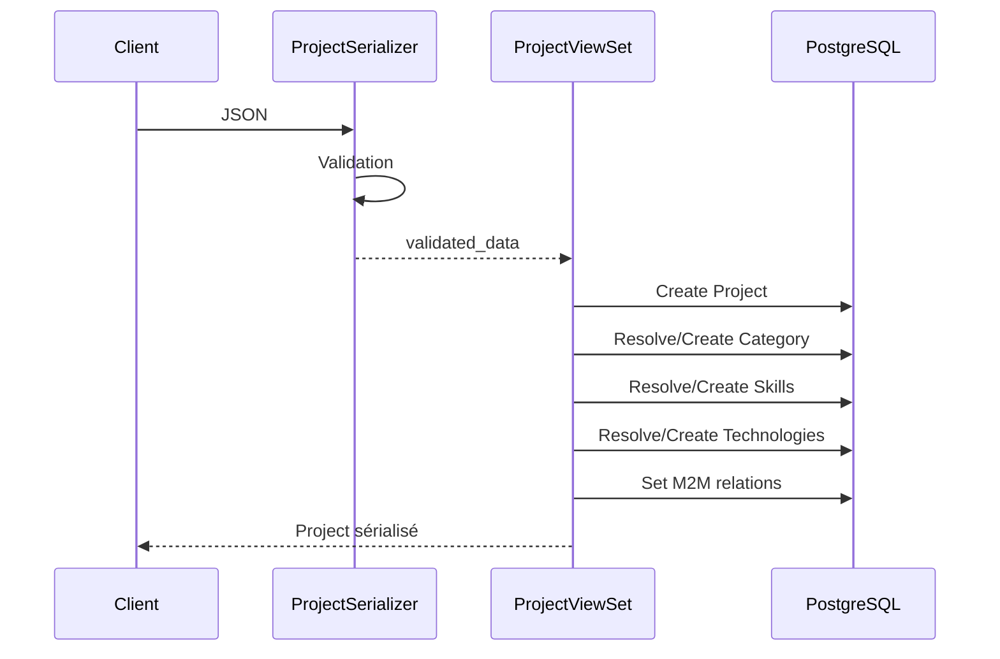

Cette séparation est importante :

> **Le serializer valide les noms. Le contrôleur orchestre leur
> résolution et leur création.**

------------------------------------------------------------------------

## 6. Validation des relations nommées

Les noms de catégories, compétences et technologies sont convertis en
slugs avec `slugify`.

Avant la création, le serializer vérifie notamment :

-   qu'un slug valide peut être généré ;
-   qu'il ne dépasse pas la taille prévue ;
-   que deux noms différents ne produisent pas accidentellement le même
    slug ;
-   qu'un slug existant n'est pas déjà associé à un autre nom.

Exemple problématique :

``` text
Nom A ─┐
       ├── slugify() ──> meme-slug
Nom B ─┘
```

L'API rejette ce cas plutôt que de fusionner silencieusement deux
concepts différents.

------------------------------------------------------------------------

## 7. Création imbriquée d'un projet

La création d'un projet peut également créer ses pages, paragraphes et
highlights en une seule requête.

Conceptuellement :

``` json
{
  "title": "Mon projet",
  "slug": "mon-projet",
  "pages": [
    {
      "slug": "architecture",
      "title": "Architecture",
      "paragraphs": [
        {
          "content": "Description..."
        }
      ],
      "highlights": [
        {
          "content": "PostgreSQL"
        }
      ]
    }
  ]
}
```

### Pourquoi seulement à la création ?

La création imbriquée est pratique pour initialiser entièrement un
projet.

En revanche, accepter ensuite un `PATCH Project` contenant
arbitrairement des pages, paragraphes et highlights rendrait les règles
beaucoup plus ambiguës :

-   faut-il créer ou modifier ?
-   qu'est-ce qui doit être supprimé ?
-   comment identifier un enfant ?
-   une liste absente signifie-t-elle « ne rien changer » ou « supprimer
    » ?

La règle choisie est donc :

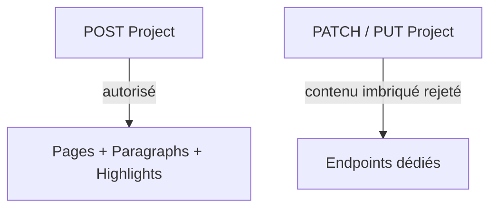

Après la création initiale, chaque ressource est modifiée par son
endpoint dédié.

------------------------------------------------------------------------

## 8. Transactions

La création complexe d'un projet est exécutée dans une transaction avec
`transaction.atomic`.

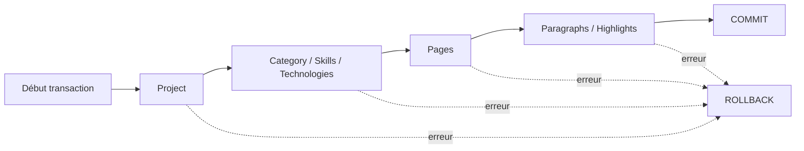

Ainsi, une erreur au milieu de la création ne laisse pas un projet
partiellement construit en base.

Les paragraphes et highlights d'une nouvelle page peuvent être créés
avec `bulk_create`, puisqu'ils sont déjà validés et ne nécessitent pas
une orchestration individuelle.

------------------------------------------------------------------------

## 9. PATCH et relations

Une attention particulière est portée à la différence entre :

``` json
{}
```

et :

``` json
{
  "skills": []
}
```

Ces deux requêtes ne signifient pas la même chose.

``` text
champ absent      -> conserver la valeur existante
skills: []        -> vider les compétences
skills: [...]     -> remplacer les compétences
category: ""      -> retirer la catégorie
```

Le contrôleur conserve cette distinction pendant `perform_update`.

------------------------------------------------------------------------

## 10. Publication

L'application distingue les données administratives des données
publiées.

### Projet

Un projet public doit avoir :

``` text
Project.published = True
```

### Page

Une page publique nécessite les deux conditions :

``` text
ProjectPage.published = True
ET
Project.published = True
```

Une page publiée appartenant à un projet brouillon reste donc invisible.

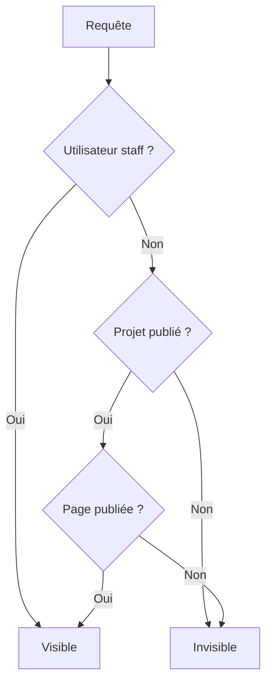

Pour les endpoints concernés, `StaffPublicationMixin` centralise cette
logique afin d'éviter de recopier les mêmes filtres partout.

------------------------------------------------------------------------

## 11. Authentification et permissions

L'administration utilise JWT via Django REST Framework / Simple JWT.

Les routes d'authentification exposent notamment l'obtention et le
rafraîchissement des tokens.

Pour les ressources classiques :

``` text
GET / HEAD / OPTIONS    -> lecture publique selon publication
POST / PUT / PATCH /
DELETE                  -> staff authentifié
```

La permission `IsAdminOrReadOnly` représente cette règle.

Un utilisateur anonyme tentant une écriture n'obtient pas les mêmes
droits qu'un utilisateur authentifié non-staff.

Le système reste volontairement simple : ChinchillAPI n'a actuellement
pas besoin d'un système complet d'inscription publique, de rôles
applicatifs complexes ou de blacklist JWT.

------------------------------------------------------------------------

## 12. Optimisation des requêtes ORM

La représentation d'un projet contient plusieurs relations.

Sans optimisation, une sérialisation naïve peut provoquer un problème
**N+1** :

``` text
1 requête projets
+ N requêtes catégories
+ N requêtes skills
+ N requêtes technologies
+ N requêtes pages
+ ...
```

Le `ProjectViewSet` précharge donc les données nécessaires avec :

-   `select_related()` pour les relations simples adaptées ;
-   `prefetch_related()` pour les relations multiples ;
-   `Prefetch()` pour contrôler précisément le queryset des pages.

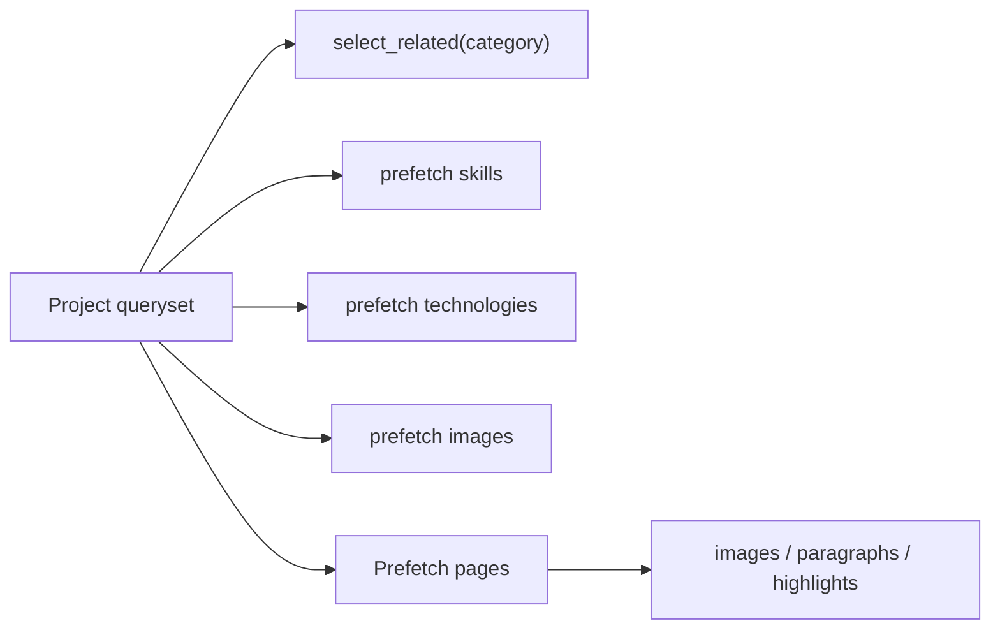

Pour un visiteur non-staff, le `Prefetch` des pages est également filtré
afin qu'une page brouillon ne fuite jamais dans la représentation
imbriquée d'un projet public.

Les tests vérifient également le nombre de requêtes sur ce parcours
critique.

------------------------------------------------------------------------

# 13. Gestion des images

Les métadonnées d'une image sont stockées en base, mais **le contenu du
fichier ne l'est pas**.

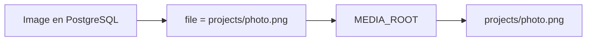

Exemple :

``` text
PostgreSQL
Image.file = "projects/photo.png"

MEDIA_ROOT
└── projects/
    └── photo.png
```

Cette séparation permet de conserver une base relationnelle légère et de
faire évoluer le backend de stockage indépendamment.

------------------------------------------------------------------------

## 14. Upload des images

Les uploads utilisent `multipart/form-data`.

Le serializer impose actuellement une taille maximale de :

``` text
10 Mio
```

La base ne reçoit donc pas le binaire de l'image : Django écrit le
fichier dans le storage configuré et conserve sa référence dans
`Image.file`.

`MEDIA_ROOT` est configurable par variable d'environnement.

En développement, sa valeur par défaut est :

``` text
<project>/media/
```

En production, il sera monté sur un stockage persistant extérieur au
conteneur.

------------------------------------------------------------------------

## 15. Images génériques et thème

Une image peut avoir un champ `theme`.

Ce champ reste volontairement une chaîne libre.

Exemples possibles :

``` text
dark
light
blue
christmas
```

Une valeur vide représente une image générique/fallback.

La signification exacte des thèmes appartient au frontend : le backend
ne doit pas connaître tous les thèmes visuels possibles.

L'API empêche cependant les associations incohérentes lorsqu'une même
ressource posséderait plusieurs images concurrentes pour le même thème.

------------------------------------------------------------------------

## 16. Association des images

Une image peut être associée :

-   directement à un projet ;
-   à une page ;
-   potentiellement à plusieurs propriétaires.

Les relations sont en Many-to-Many.

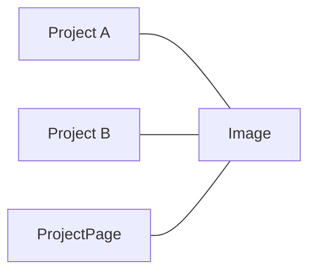

Cette possibilité de partage influence directement la suppression et la
publication.

Une image ne doit pas être considérée privée simplement parce qu'un de
ses propriétaires est privé si elle possède également une association
publique valide.

------------------------------------------------------------------------

# 17. Accès contrôlé aux fichiers

`MEDIA_ROOT` **n'est pas exposé directement** au navigateur.

L'API fournit une route contrôlée :

``` text
GET /api/images/<uuid>/file/
```

Le champ `file` de `ImageSerializer` renvoie cette URL plutôt qu'une URL
physique `/media/...`.

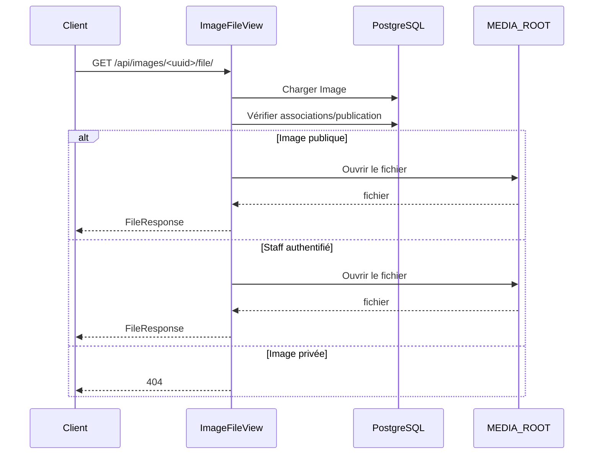

## Pourquoi ne pas exposer `/media/` ?

Une route publique comme :

``` text
/media/projects/photo.png
```

court-circuiterait complètement les règles de publication.

Un utilisateur connaissant le chemin pourrait accéder directement au
fichier.

Par conséquent :

-   Django ne sert pas directement `MEDIA_URL` ;
-   le reverse proxy ne devra pas exposer `MEDIA_ROOT` ;
-   l'accès passe par la route contrôlée.

------------------------------------------------------------------------

## 18. Publication d'une image

Pour un visiteur public, une image est accessible si elle possède **au
moins une association publique valide**.

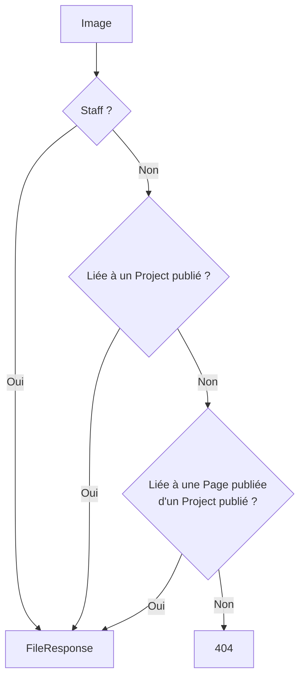

Ainsi :

``` text
Image -> Project privé                       = privée
Image -> Page publiée / Project privé        = privée
Image -> Page privée / Project publié        = privée
Image -> Page publiée / Project publié       = publique
Image -> Project publié                      = publique
Image -> Project privé + Project publié      = publique
Image sans propriétaire                      = staff uniquement
```

Un utilisateur staff peut accéder aux images privées ou non associées.

------------------------------------------------------------------------

## 19. Pourquoi renvoyer 404 pour une image privée ?

L'API utilise volontairement `404 Not Found` pour :

-   un UUID inexistant ;
-   une image non accessible ;
-   un fichier physique absent.

Cela évite de révéler à un utilisateur public qu'une ressource privée
existe.

``` text
"Cette image existe mais vous n'avez pas le droit de la voir"
```

constituerait déjà une information sur le contenu privé.

------------------------------------------------------------------------

## 20. Streaming des fichiers

Les fichiers sont retournés avec `FileResponse`.

Cela permet de lire le fichier par blocs au lieu de charger son contenu
complet en mémoire avant l'envoi.

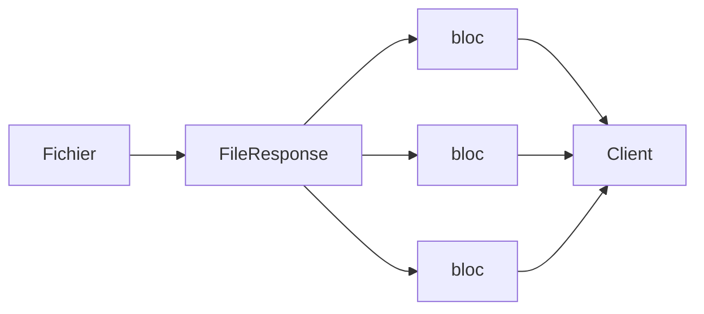

Cette approche est particulièrement importante pour les fichiers plus
volumineux.

------------------------------------------------------------------------

## 21. Cache des médias privés

La route contrôlée utilise `never_cache`.

Exemple :

1.  une image est publique ;
2.  un client la consulte ;
3.  le projet est dépublié ;
4.  l'image doit immédiatement repasser derrière le contrôle d'accès.

Un cache HTTP mal configuré pourrait sinon continuer à servir une
ancienne réponse publique.

Le choix actuel privilégie donc la correction des permissions à chaque
requête.

------------------------------------------------------------------------

## 22. Négociation de contenu de `ImageFileView`

`ImageFileView` retourne un `FileResponse` et non une réponse JSON DRF
classique.

La négociation de contenu DRF est donc forcée afin qu'un client
demandant uniquement un type d'image ne soit pas rejeté prématurément
par DRF avant que le fichier puisse être retourné.

Ce comportement est volontaire et couvert par les tests.

Les erreurs continuent quant à elles à utiliser le mécanisme de réponse
DRF.

------------------------------------------------------------------------

## 23. Prévisualisation d'une image privée

Une image publique peut être utilisée directement :

``` html
/file/" alt="...">
```

Pour une image privée, une simple balise `` ne permet pas d'ajouter
le header :

``` text
Authorization: Bearer <JWT>
```

Un frontend d'administration devra donc typiquement :

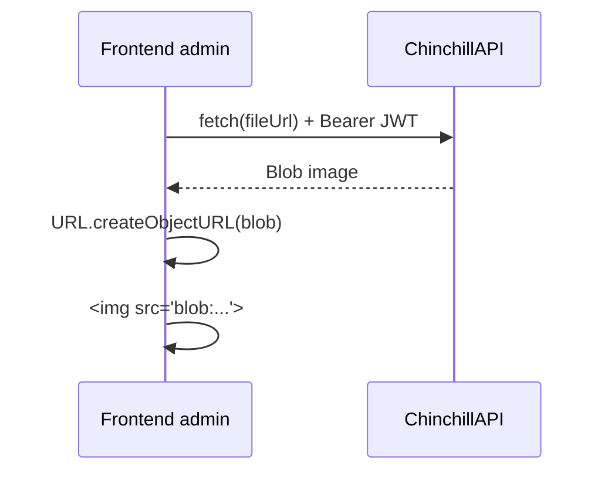

Ce mécanisme pourra être ajouté lorsque l'interface d'administration en
aura besoin.

------------------------------------------------------------------------

## 24. Suppression des images partagées

Lorsqu'une image est retirée d'un propriétaire, elle ne doit pas
nécessairement être supprimée physiquement.

La règle actuelle est :

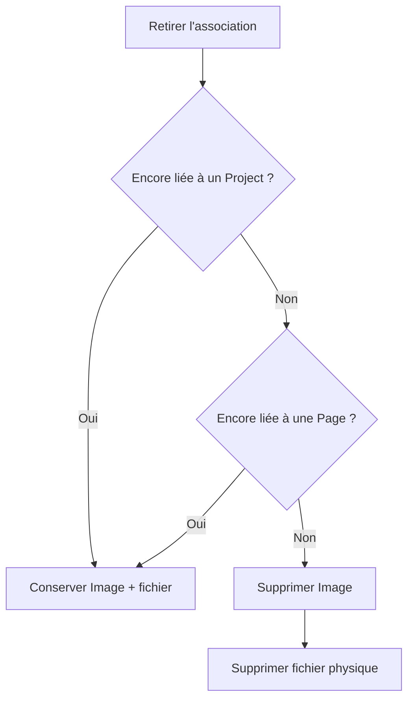

Cela évite qu'une suppression dans un projet casse une image encore
utilisée ailleurs.

------------------------------------------------------------------------

# 25. Endpoints imbriqués et propriétaires

Pour les collections d'images appartenant à un projet ou une page, le
contrôleur commence par déterminer si le **propriétaire** est visible.

Conceptuellement :

``` python
owners = filter_public_queryset(...)
owner = owners.first()

if owner is None:
    return Image.objects.none()

return owner.images.all()
```

La logique est donc :

``` text
1. trouver le propriétaire demandé ;
2. appliquer les règles de publication ;
3. seulement ensuite retourner ses images.
```

Cela évite de raisonner uniquement depuis la relation inverse
`Image -> owners`, ce qui pourrait rendre les règles de visibilité plus
difficiles à maintenir.

Pour une collection dont le propriétaire est invisible, le contrat
actuel est une collection vide.

Pour un fichier individuel privé, le contrat est `404`.

------------------------------------------------------------------------

# 26. Tests

L'application possède une suite de tests Pytest couvrant les
comportements métier et API.

Au moment de cette documentation :

``` text
205 tests
~99,4 % de couverture
PostgreSQL utilisé pour les tests
```

La couverture n'est cependant pas l'objectif en elle-même : les tests
doivent protéger les contrats importants.

## Principaux groupes testés

Les tests couvrent notamment :

-   CRUD des ressources ;
-   permissions public/staff ;
-   JWT ;
-   publication des projets ;
-   publication des pages ;
-   absence de fuite des pages brouillon dans les projets ;
-   création imbriquée ;
-   rejet des nested writes non supportés ;
-   unicité des slugs ;
-   collisions de relations nommées ;
-   validation des dates ;
-   uploads multipart ;
-   limite de taille des images ;
-   association d'images ;
-   images partagées ;
-   accès aux fichiers publics ;
-   accès staff aux fichiers privés ;
-   refus d'accès public aux fichiers privés ;
-   fichier physique absent ;
-   requêtes `HEAD` ;
-   comportement du cache ;
-   nombre de requêtes ORM.

------------------------------------------------------------------------

## 27. Tests des fichiers sans polluer le projet

Les tests média utilisent un stockage temporaire.

Ils ne doivent pas écrire leurs fichiers dans le vrai :

``` text
media/
```

du développeur ou du serveur.

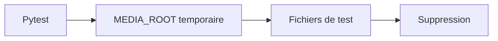

Cela rend les tests :

-   reproductibles ;
-   isolés ;
-   sans effets secondaires sur les fichiers réels.

------------------------------------------------------------------------

# 28. Choix d'architecture importants

## UUID plutôt qu'identifiants incrémentaux exposés

Les modèles principaux utilisent des UUID.

Ils évitent de faire dépendre l'API d'une numérotation séquentielle
globale et conviennent bien aux ressources exposées par API.

Les slugs restent utilisés lorsqu'une URL humaine est préférable.

------------------------------------------------------------------------

## PostgreSQL comme base réelle

Le projet utilise PostgreSQL plutôt que de développer exclusivement sur
SQLite.

L'objectif est de tester localement avec un comportement aussi proche
que possible de la production.

------------------------------------------------------------------------

## Pas de logique métier complexe dans les serializers

Les serializers :

-   valident ;
-   transforment ;
-   sérialisent.

Les ViewSets/contrôleurs :

-   orchestrent ;
-   résolvent les relations ;
-   créent les objets associés ;
-   décident du déroulement d'une opération.

------------------------------------------------------------------------

## Pas de nested PATCH récursif

La simplicité du contrat API est privilégiée à une écriture récursive
extrêmement flexible mais ambiguë.

------------------------------------------------------------------------

## Pas d'exposition directe de `MEDIA_ROOT`

Les droits d'accès aux images dépendent de l'état de publication en
base.

Le fichier ne peut donc pas être servi comme un simple fichier statique
public.

------------------------------------------------------------------------

## Pas de stockage objet pour l'instant

Le projet est destiné à être auto-hébergé sur un serveur disposant de
stockage persistant.

Un stockage local monté dans Docker est donc suffisant pour la version
actuelle.

L'utilisation de l'abstraction Django pour les fichiers permet néanmoins
de ne pas lier toute l'application à cette décision.

------------------------------------------------------------------------

# 29. Déploiement cible

L'architecture de production visée est :

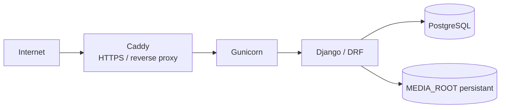

Le conteneur applicatif doit rester remplaçable.

Les données persistantes ne doivent donc pas dépendre de son filesystem
éphémère.

Pour les médias, la cible prévue est un montage du type :

``` text
Hôte
/srv/media/chinchillapi/
        │
        ▼
Docker
/app/media/
```

`MEDIA_ROOT` dans le conteneur pointera vers `/app/media`.

Les fichiers statiques Django utilisent un stockage distinct via
`STATIC_ROOT`.

> Le reverse proxy ne devra jamais publier directement `/app/media` ou
> `/srv/media/chinchillapi`, car cela contournerait `ImageFileView`.

------------------------------------------------------------------------

# 30. Flux complet d'une image en production

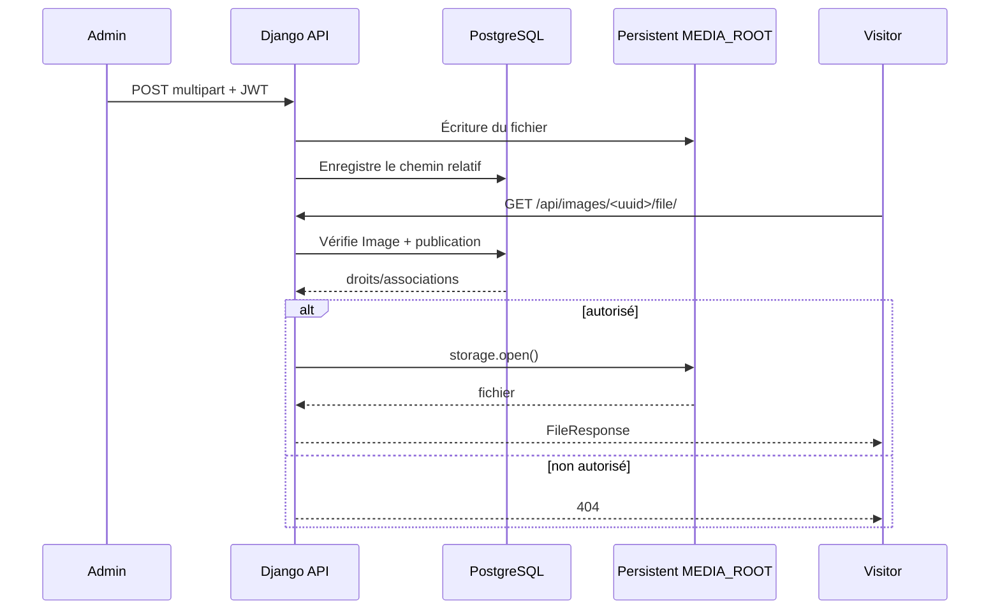

La base connaît **la référence du fichier**.

Le storage connaît **les octets du fichier**.

Le contrôleur connaît **les règles permettant de l'exposer**.

------------------------------------------------------------------------

# 31. Points volontairement reportés

L'application est déjà fonctionnelle, mais certains sujets peuvent être
traités plus tard sans compliquer inutilement la première version :

-   interface d'administration frontend dédiée ;
-   prévisualisation JWT des images privées ;
-   validation plus poussée des dimensions/formats d'images ;
-   politique complète de nettoyage des fichiers orphelins ;
-   gestion avancée des remplacements de fichiers ;
-   stockage objet distant si le besoin apparaît ;
-   pagination si le volume de projets devient significatif ;
-   rôles utilisateurs plus complexes ;
-   blacklist/logout JWT si un véritable besoin apparaît.

Ces sujets ne doivent pas être ajoutés uniquement « au cas où ».

------------------------------------------------------------------------

# 32. Principes retenus

L'application `projects` suit quelques principes simples :

1.  **Le contrôleur orchestre.**
2.  **Le serializer valide et représente.**
3.  **La base garantit les contraintes structurelles importantes.**
4.  **Les relations explicites valent mieux que les comportements
    magiques.**
5.  **Un brouillon ne doit jamais fuiter par une relation imbriquée.**
6.  **Les fichiers privés ne doivent jamais être accessibles en
    contournant l'API.**
7.  **Un conteneur est jetable ; les données ne le sont pas.**
8.  **Les tests protègent les contrats, pas un pourcentage de
    couverture.**
9.  **On optimise les requêtes lorsqu'un vrai parcours le justifie.**
10. **On n'ajoute pas de complexité tant qu'un besoin réel ne l'exige
    pas.**

------------------------------------------------------------------------

# 33. Résumé

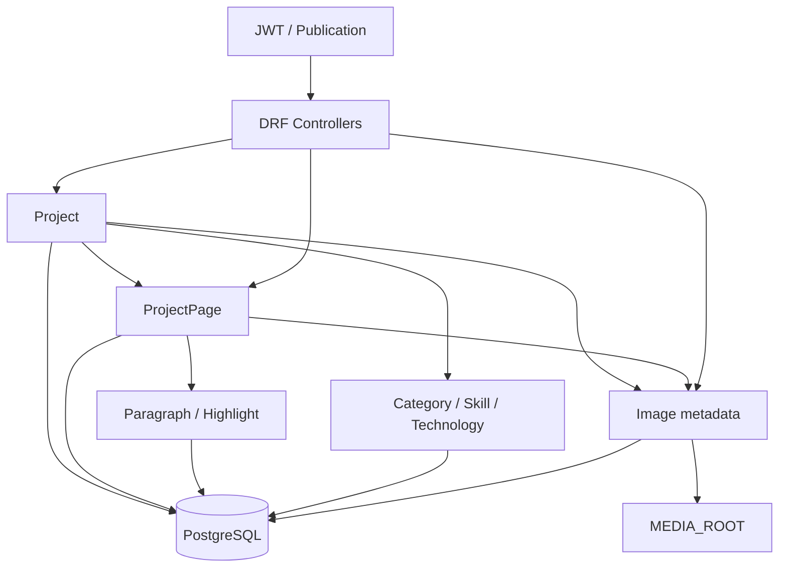

`projects` est ainsi devenu un module portfolio complet plutôt qu'un
simple CRUD : il possède un contrat API explicite, une gestion cohérente
de la publication, des relations métier, une stratégie média protégée et
une suite de tests suffisamment large pour permettre la prochaine étape
: **le déploiement Docker persistant et la mise en production**.
